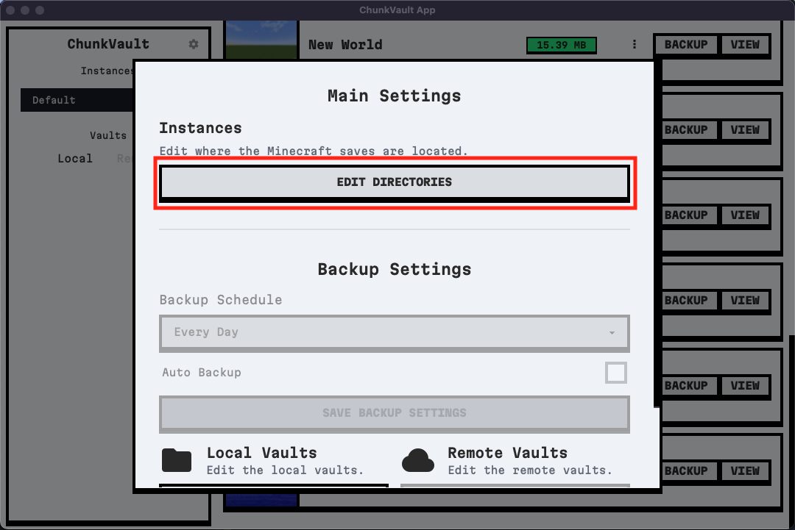
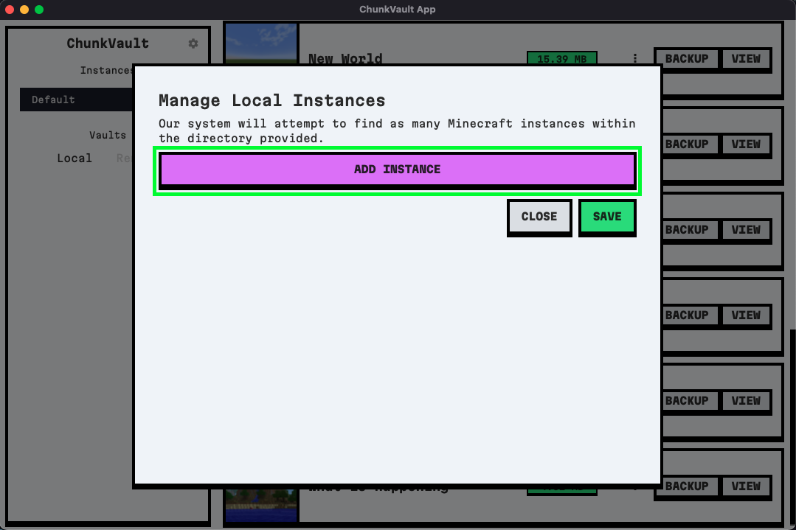
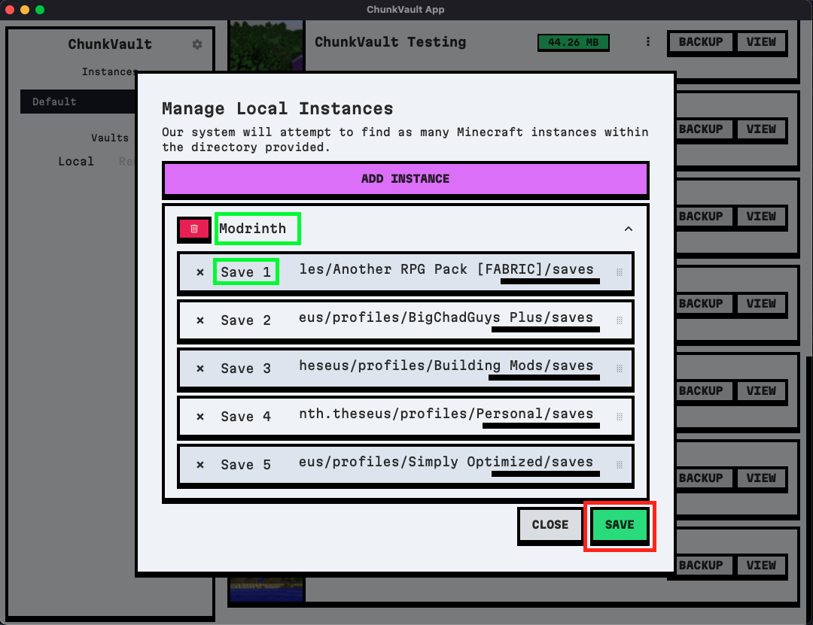

ChunkVault has the ability to scan Minecraft instances, such as Modrinth or Prism Launcher, and grab all save locations within those launchers. However, currently, there is no way to automatically update and grab new instances. This feature is on our to-do list and will be available in a future release.

## Adding Instances

1. If you need to add Minecraft instances to your application, click on the Gear icon to open the Settings page.

    

2. In the Settings page, click on "Edit Direcotires" to add new instances.

    

3. Click on "Add Instance" to add a new instance. When our system is given a folder, it will recursively search for multiple Minecraft save locations within that folder. This is a good place to add the main folder for a launcher like Modrinth or Prism, or any other launcher the user may use. The system will create a category for the instance that the user can modify.

    

4. Once the instance has been added, the user can modify the instance's name and category (highlighted in green). The user can also add a new category by clicking on the "Add Instance" button again. Additionally, the user can drag and drop items from one category to another for better organization.

    

5. Once the user is done adding instances, they can click on the "Save" button to save their changes.