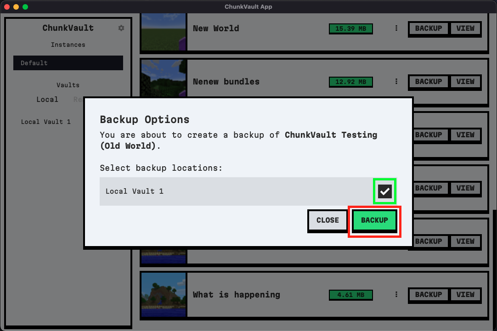

### Creating Backups

1. Creating backups in ChunkVault is straightforward. Follow the steps illustrated in the screenshots below.

   The first screenshot shows where to click to initiate the backup process.

   

   The second screenshot shows where to select the backup location. If a default location is set, it will be automatically selected.

   

2. Once you've selected the desired vaults (you can select multiple), click on 'Backup'. The system will then create a backup in the selected vaults.

### Restoring Backups

1. When you need to restore a backup, click on the 'Restore' button. The system will then show you a list of locations that are available to restore the world too.

   
   
   

   

2. Select the desired location and click on 'Restore'. If 'Replace world' is selected, the system will copy the ID of the world from the backup instead of creating a new one. This means that if a backup is made from this restored world, it will be saved to the original backup location, not a new one. Please note that this will overwrite any existing verions of this world in the selected locations, so proceed with caution!

### Deleting Backups

Deleting backups is easy. Simply click the three dots on the backup you want to delete and click 'Delete', then confirm the deletion, the system will purge all snapshots of the world from the selected vault.

