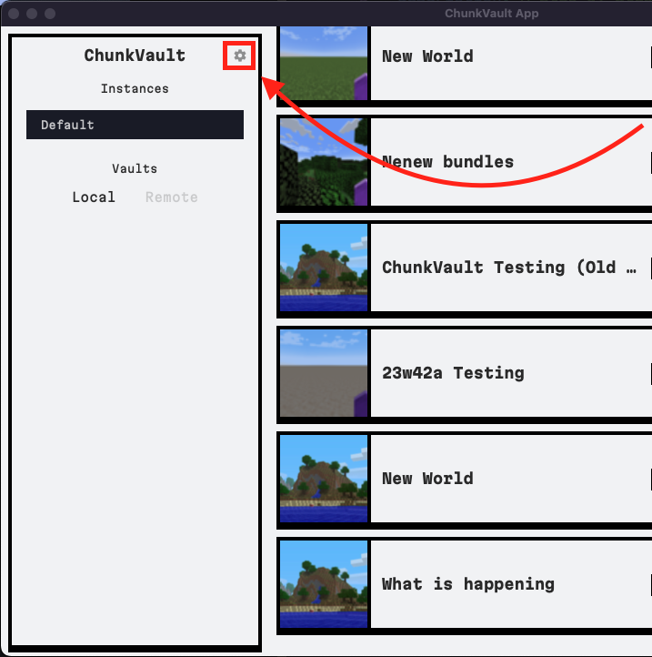

This guide provides an overview of how to manage vaults in ChunkVault Desktop. Currently, only local vaults are supported. In the future, we plan to introduce cloud vaults. More information about this will be available in our [Vault Server](/vault/) section when it becomes available.

## Local Vaults

1. If you need to add Local Backup vaults or more instances to your application, click on the Gear icon. The system will automatically build vault locations when added by the user via the Local Vaults setting in the Settings page (Gear icon).

   

2. You can add as many vault locations as you need. Each vault location will be treated as a separate backup location, allowing you to manage your Minecraft worlds more efficiently.

   
   
   

   Selecting default will add the vault to the default vaults list, which will be used when creating backups.

<!-- 3. For a step-by-step guide on how to add vault locations, watch the following video:

     -->

## Cloud Vaults

This feature is not yet available. Please check back later.
